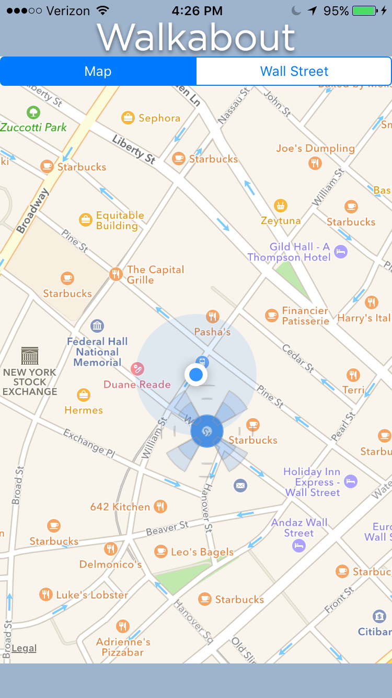

# WalkAbout

Walkabout is your mobile tour guide for iOS, serving as an alternative to private tour guides or large tour groups. When you approach one of Walkabout's monuments, the app voices a brief description and history, and displays a photo and text transcript. Walkabout features eight monuments, and may be expanded to include many more.

Team:
Andrew Kim
Devin Mandelbaum
Claire Samuels 
Zander Nelson

#General Instructions

1. At opening, the application displays a fullscreen map centered on your location.
2. Your location is marked with a blue dot. Monuments are marked with Walkabout's icon.
3. When you step within range of a monument, it automatically switches to a detail view and starts audio narration.
4. The detail view displays a photo of the monument and a text transcript of the narration. At the top is a tab bar for toggling detail and map views. Above the text are audio controls.
5. The audio controls let you restart, play/resume, and pause.
6. When you go out of range of the monument, the you're returned to the fullscreen map.

#Technical Details

* Walkabout was written in React Native, primarily in JavaScript ES6.
* We wrote our own geofencing algorithm, using the Pythagorean Theorem to establish our distance from each monument.
* We used React-Native-Sound as our audio player, and MapView Component to display our maps and follow the user's location.
* We used the built-in Location Services via Background Geolocation for React Native to acquire the current position of the user.
